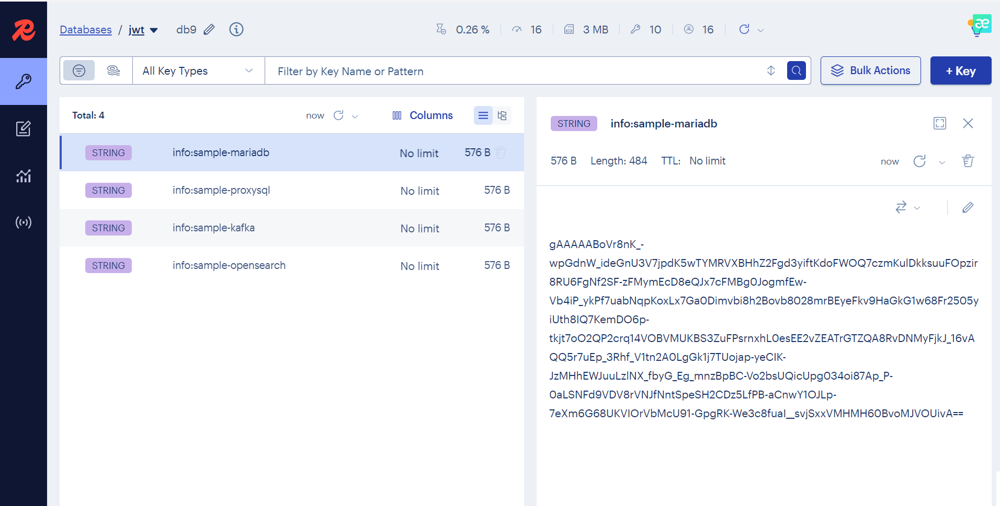

# Redis KeyVault

Redis Sentinel을 사용하여 암호화된 키-값 저장소를 구현한 Python 라이브러리입니다. 중요한 정보를 안전하게 암호화하여 Redis에 저장하고 조회할 수 있습니다.

## 주요 기능

- **암호화된 데이터 저장**: Fernet 암호화를 사용하여 데이터를 안전하게 저장
- **Redis Sentinel 지원**: 고가용성을 위한 Redis Sentinel 클러스터 연결
- **JSON 데이터 지원**: JSON 형태의 복합 데이터 저장 및 조회
- **환경 변수 암호화**: Redis 연결 정보도 암호화하여 .env 파일에 저장
- **CLI 인터페이스**: 명령줄에서 쉽게 데이터 저장 및 조회

## 설치

필요한 패키지를 설치합니다:

```bash
pip install redis cryptography python-dotenv
```

## 설정

### 1. 초기 설정

스크립트를 처음 실행하면 Redis Sentinel 설정을 입력하라는 메시지가 나타납니다:

```bash
python redis_keyvault.py
```

다음 정보를 입력해야 합니다:
- Sentinel 노드 수 (최소 3개, 홀수)
- Sentinel master 이름
- Socket timeout 값
- Redis 비밀번호
- Redis DB 번호 (0-15)
- 각 Sentinel 노드의 호스트명과 포트

### 2. 환경 변수 구조

설정이 완료되면 `.env` 파일이 생성되며, 다음과 같은 암호화된 환경 변수들이 저장됩니다:

```
HASH_KEY=<암호화키>
REDIS_SENTINEL_NODE_COUNT=3
REDIS_SENTINEL_MASTER_NAME=<암호화된_마스터명>
REDIS_SENTINEL_TIMEOUT=<암호화된_타임아웃>
REDIS_PASSWORD=<암호화된_비밀번호>
REDIS_DB=<암호화된_DB번호>
REDIS_SENTINEL_NODE_1=<암호화된_노드1정보>
REDIS_SENTINEL_NODE_2=<암호화된_노드2정보>
REDIS_SENTINEL_NODE_3=<암호화된_노드3정보>
```

## 사용법

### 명령줄 인터페이스

#### 데이터 저장
JSON 파일의 내용을 Redis에 저장합니다:

```bash
python redis_keyvault.py save <json_파일>
```

예시:
```bash
python redis_keyvault.py save database-config.json
```

#### 데이터 조회
저장된 데이터를 키로 조회합니다:

```bash
python redis_keyvault.py get <키>
```

예시:
```bash
python redis_keyvault.py get database-config
```

### Python 모듈로 사용

```python
from redis_keyvault import save_info, get_info, get_redis_connection

# 데이터 저장
data = {
    "host": "localhost",
    "port": 3306,
    "username": "admin",
    "password": "secret"
}
save_info("my-database", data)

# 데이터 조회
retrieved_data = get_info("my-database")
print(retrieved_data)

# Redis 연결 객체 직접 사용
redis_conn = get_redis_connection()
redis_conn.set("simple-key", "simple-value")
```

## 사용 방법 (Usage)

### 1. 초기 설정

처음 실행 시 Redis Sentinel 설정을 위한 대화형 프롬프트:

```bash
(rkv) H:\git_repo\redis-as-kv>python redis_keyvault.py

.env 파일이 존재하지 않습니다.

=== Redis Sentinel 설정 정보 입력 ===

Sentinel 노드 수를 입력하세요 (최소 3개, 홀수): 3

Sentinel master 이름 (예: redismaster): redismaster
Socket timeout 값 (예: 1.0): 1.0
Redis 비밀번호: data123!
Redis DB 번호 (0-15): 9

=== Sentinel 노드 1 정보 입력 ===
Sentinel 호스트명(예: L4, node1): 30.0.0.30
Sentinel 포트 번호: 3410

=== Sentinel 노드 2 정보 입력 ===
Sentinel 호스트명(예: L4, node1): 30.0.0.31
Sentinel 포트 번호: 3410

=== Sentinel 노드 3 정보 입력 ===
Sentinel 호스트명(예: L4, node1): 30.0.0.32
Sentinel 포트 번호: 3410

.env 파일이 성공적으로 생성되었습니다.

이제 아래 명령어를 사용할 수 있습니다:
  python redis_keyvault.py save <json_파일>
  python redis_keyvault.py get <키>
```

### 2. 데이터 저장

샘플 JSON 파일들을 Redis KeyVault에 저장:

```bash
(rkv) H:\git_repo\redis-as-kv>python redis_keyvault.py save samples/sample-proxysql.json
데이터가 성공적으로 저장되었습니다. (키: info:sample-proxysql)

(rkv) H:\git_repo\redis-as-kv>python redis_keyvault.py save samples/sample-kafka.json   
데이터가 성공적으로 저장되었습니다. (키: info:sample-kafka)

(rkv) H:\git_repo\redis-as-kv>python redis_keyvault.py save samples/sample-opensearch.json 
데이터가 성공적으로 저장되었습니다. (키: info:sample-opensearch)

(rkv) H:\git_repo\redis-as-kv>python redis_keyvault.py save samples/sample-mariadb.json    
데이터가 성공적으로 저장되었습니다. (키: info:sample-mariadb)
```

### 3. 데이터 조회

저장된 설정을 키로 조회:

```bash
(rkv) H:\git_repo\redis-as-kv>python redis_keyvault.py get sample-proxysql
{
    "hostname": "proxysql.host.com",
    "dbms": "mydatabase",
    "user": "proxysql-user",
    "password": "mypassword!",
    "port": 2503,
    "external_hostname": "external_hostname.com",
    "external_port": 2503,
    "describe": "mariadb proxysql",
    "memo": "user = proxysql-user",
    "ssl_option": "no",
    "ip": "30.0.0.30"
}

(rkv) H:\git_repo\redis-as-kv>python redis_keyvault.py get sample-opensearch
{
    "hostname": "opensearch.example.com",
    "port": 9200,
    "username": "admin",
    "password": "opensearch_password",
    "index": "application-logs",
    "ssl": true,
    "timeout": 30,
    "describe": "OpenSearch cluster for application logs",
    "memo": "Production cluster with SSL enabled",
    "cluster_name": "production-opensearch"
}

(rkv) H:\git_repo\redis-as-kv>python redis_keyvault.py get sample-kafka
{
    "hostname": "kafka.example.com",
    "port": 9092,
    "username": "kafka_user",
    "password": "kafka_password",
    "topic": "application-events",
    "group_id": "production-consumer",
    "ssl": true,
    "timeout": 30,
    "describe": "Kafka message broker",
    "memo": "Production Kafka cluster with SASL authentication",
    "protocol": "SASL_SSL"
}

(rkv) H:\git_repo\redis-as-kv>python redis_keyvault.py get sample-mariadb
{
    "hostname": "mariadb.example.com",
    "port": 3306,
    "database": "production_db",
    "username": "app_user",
    "password": "secure_password",
    "charset": "utf8mb4",
    "ssl": true,
    "timeout": 30,
    "describe": "MariaDB production database",
    "memo": "Main application database with SSL",
    "dbms": "mariadb"
}
```

### 4. 실행 결과



## 예시 JSON 파일

`database-config.json`:
```json
{
    "host": "db.example.com",
    "port": 3306,
    "database": "production",
    "username": "app_user",
    "password": "secure_password",
    "ssl": true,
    "connection_timeout": 30
}
```

## 보안 특징

- **이중 암호화**: 데이터와 연결 정보 모두 암호화
- **Fernet 암호화**: 대칭 키 암호화로 안전한 데이터 보호
- **환경 변수 보호**: Redis 연결 정보도 암호화하여 저장
- **키 네임스페이싱**: 모든 키에 `info:` 접두사를 사용하여 네임스페이스 분리

## 요구사항

- Python 3.6+
- Redis Server with Sentinel
- 필수 패키지:
  - `redis`
  - `cryptography`
  - `python-dotenv`

## 에러 처리

- Redis 연결 실패 시 명확한 오류 메시지 제공
- JSON 파싱 오류 감지 및 처리
- 암호화/복호화 실패 시 적절한 예외 처리
- 환경 설정 검증

## 라이선스

이 프로젝트는 [LICENSE](LICENSE) 파일에 명시된 라이선스를 따릅니다.

## 기여하기

1. 이 저장소를 포크합니다
2. 기능 브랜치를 생성합니다 (`git checkout -b feature/AmazingFeature`)
3. 변경사항을 커밋합니다 (`git commit -m 'Add some AmazingFeature'`)
4. 브랜치에 푸시합니다 (`git push origin feature/AmazingFeature`)
5. Pull Request를 생성합니다

## 문제 신고

문제점이나 개선사항이 있다면 [Issues](../../issues) 페이지에서 신고해주세요.
